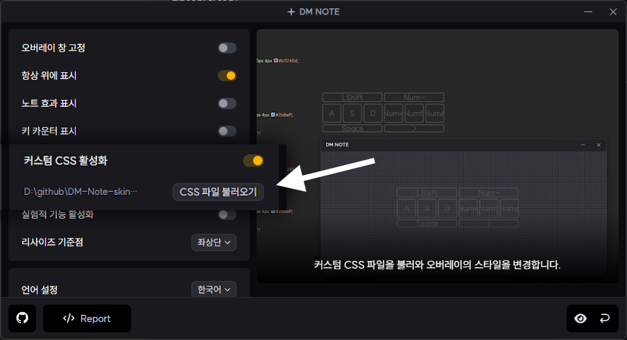
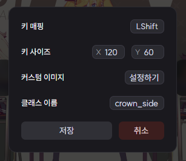
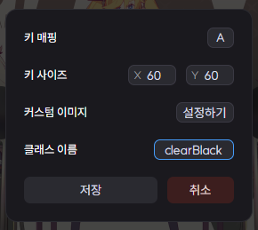
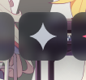

# Glassic

반투명 컨샙의 커스텀 CSS 스킨  

뒤에 이미지 넣은 버튼 배경처럼 하면 뒤쪽에 흐릿하게 처리되서 이쁨  
( 스킨에 배경 이미지 미포함, 출처: [공식 1주일 기념 배경화면](https://store.steampowered.com/news/app/960170/view/4178750236019857093?l=koreana) )

- [다운로드](https://download-directory.github.io/?url=https%3A%2F%2Fgithub.com%2FDominoKorean%2FDM-Note-skins%2Ftree%2Fmain%2FDM%2520Note%2FGlassic)

## 사용법

설정에서 커스텀 CSS 활성화 키고  
`CSS 파일 불러오기`에서 `Glassic.css` 파일 불러오기

### 아이콘 사용법  

키 누르면 **클래스 이름**이라고 있는데  
아래 아이콘 목록중에 원하는거 적으면 텍스트가 그 아이콘으로 대체됨

|클래스 이름|아이콘|
|:-:|:-:|
|clear||
|fail||
|crown||
|crown_side||

클래스 이름 옆에 띄어쓰기 없이 대소문자 지켜서 `Black`이라고 쓰면  
로고 색이 텍스트랑 동일한 흰색으로 변함  

 

## 팁
배경 이미지 넣는 키 640 * 360 비율로 하면 알맞음  
( 16:9에서 x40한 크기 )

## 스크린샷

- [영상 - **아이콘 적용, with 배경**](https://youtu.be/myKAvnTWZhI?si=GRv2PBsdCi21IUHn)
- [영상 - **아이콘 Black, 노트효과**](https://youtu.be/kSZrxBij1R8?si=fD9EpZGDygQq17Y_)
- [영상 - **아이콘 비적용, 키카운터 켜짐**](https://youtu.be/tBWXC1XuVf0?si=PRFfb2VGdblGYmqh)  
( 실제론 키카운터 밝은부분에서 영상보다 더 잘보이게 패치됨 )